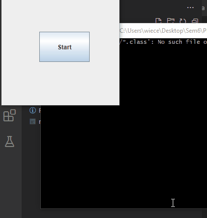

# JavaSnake
Classic snake game using A* algorithm and architectures inspired by Unity Engine. The game implemented in Java environment.

Project implemented as part of the university course "Programing Platforms .NET and Java".

**[Polska wersja README](README.pl.md)**



## List of content
- [JavaSnake](#javasnake)
  - [List of content](#list-of-content)
  - [Authors](#authors)
  - [Build and run](#build-and-run)
  - [Description](#description)
  - [Documentation](#documentation)
    - [UML diagrams](#uml-diagrams)


## Authors
- [Michał Więcek](https://github.com/wiecek1873),
- [Mateusz Górka](https://github.com/goorkamateusz/)


## Build and run
You can build and run app by commands:

```sh
javac src/*.java
java -classpath src JavaSnake
```

The same command you can run by `run.sh` script file.


## Description
- `green snake` - player;
- `blue snake` - AI, enemies;
- `black points` - obstacles;
- `red points` - fruits (snake score one point);
- `ping points` - amphibian (running aim, snake score to two points);


## Documentation
[Link to documentation](https://goorkamateusz.github.io/JavaSnake/)

Documentation generated by `javadoc`.

### UML diagrams
~[UML-diagrams](docs/img/uml-documentation.png)
