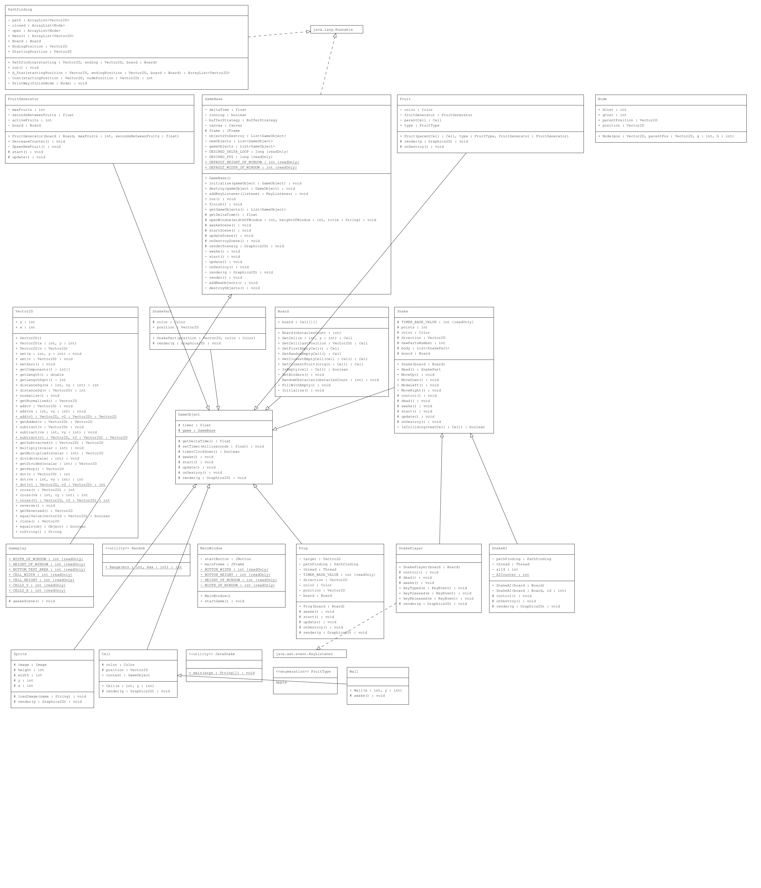

# JavaSnake
Klasyczna gra snake z wykorzystaniem algorytmu A* oraz architekturą inspirowaną silnikiem Unity. Zaimplementowana w środowisku Java.

Projekt w ramach kursu Platformy Programistyczne .NET i Java na specjalności Technologie Informacyjne w Automatyce.


## Spis Treści
- [JavaSnake](#javasnake)
  - [Spis Treści](#spis-treści)
  - [Autorzy](#autorzy)
  - [Budowa aplikacji i uruchomienie](#budowa-aplikacji-i-uruchomienie)
  - [Opis gry](#opis-gry)
  - [Dokumentacja](#dokumentacja)
    - [Schemat klas UML](#schemat-klas-uml)


## Autorzy
- [Michał Więcek](https://github.com/wiecek1873),
- [Mateusz Górka](https://github.com/goorkamateusz/)


## Budowa aplikacji i uruchomienie
Aplikację można zbudować oraz uruchomić za pomocą poleceń:

```sh
javac src/*.java
java -classpath src JavaSnake
```

Dla ułatwienia dane polecenia zostały zawarte w skrypcie `run.sh`.


## Opis gry
- `zielony wąż` - gracz;
- `niebieskie węże` - AI, przeciwnicy;
- `czarne punkty` - przeszkody;
- `czerwone punkty` - owoce (wąż zdobywa punkt);
- `różowe punkty` - płazy (uciekający cel, wąż zdobywa 2 punkty);


## Dokumentacja
[Link do dokumentacji](https://goorkamateusz.github.io/JavaSnake/)

Dokumentacja wygenerowana za pomocą `javadoc`.

### Schemat klas UML


Pełnych wymiarów zdjęcie można otworzyć [tutaj](docs/img/uml-documentation.png).
